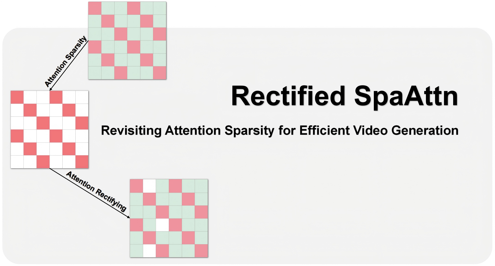
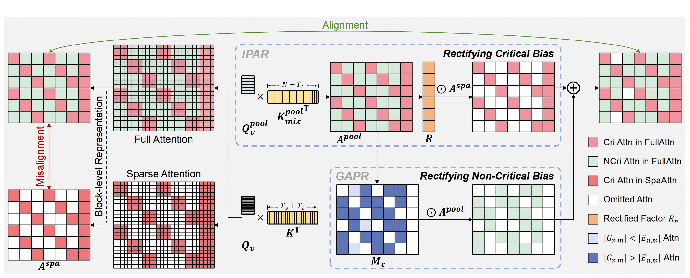
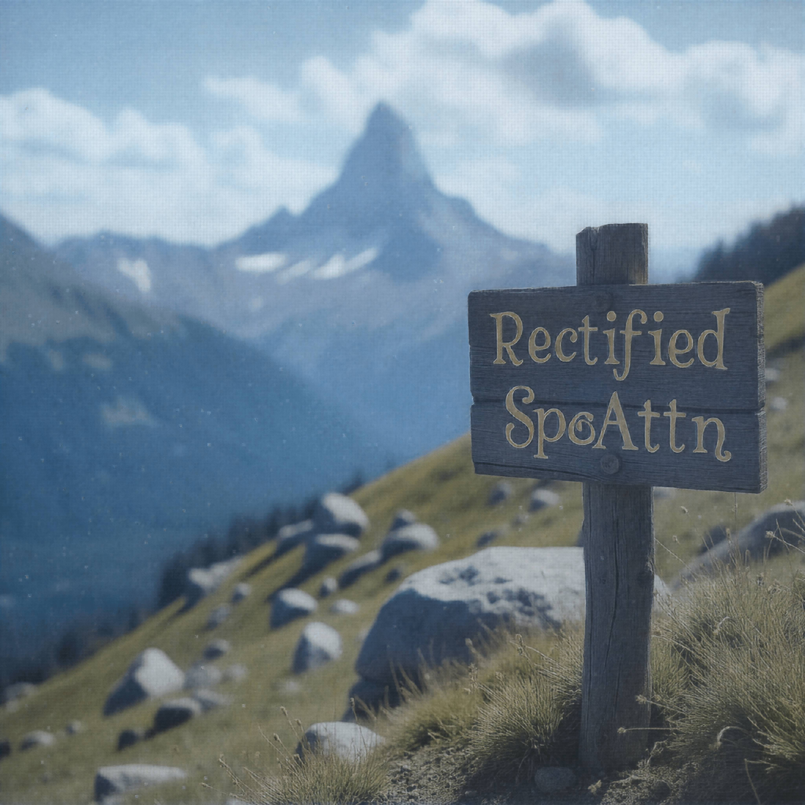

<p align="center">
  
</p>

<h5 align="center">

[](https://arxiv.org/abs/2409.14307)
[](https://github.com/BienLuky/Rectified-SpaAttn)
 <br>


## 🔥 News

- [2025/11] Rectified SpaAttn is open-sourced! HunyuanVideo, Wan2.1, and Flux.1-dev can be accelerated by 4-9×.

## 📖 Overview
Rectified SpaAttn rectifies sparse attention allocation with implicit full attention reference, thereby enhancing the alignment between sparse and full attention maps.
<p align="center">
  
</p>

## 📃 Open-source Plan

- Model Adaptation
  - [ ] Wan2.2 (I2V / T2V)
  - [√] HunyuanVideo, Wan2.1 (I2V / T2V), Flux.1-dev
- Engineering Optimization
  - [ ] FP8 Attention
  - [ ] RoPE & Norm Kernel
  - [ ] FA3 Adaptation

We warmly welcome and sincerely appreciate contributions from the community to further enhance Rectified SpaAttn. 
If your generative model is hindered by attention latency, please feel free to contact us—we are more than willing to help integrate Rectified SpaAttn into your model.

## 🛠️ Installation
Rectified SpaAttn features a straightforward installation procedure with the following two steps:

```bash
# 1. Repository Cloning
git clone https://github.com/BienLuky/Rectified-SpaAttn.git
cd Rectified-SpaAttn

# 2. Conda Environment Setup 
conda create -n rectified python==3.10.19 
conda activate rectified

pip install PyTorch # We recommend using CUDA versions 12.4 / 12.8 + PyTorch versions 2.5.1 / 2.6.0
pip install -r requirements # Install other packages
pip install flash-attn --no-build-isolation

```

## 🚀 Inference Examples

### HunyuanVideo

The running scripts are:
```bash
python main_hunyuan.py  # Rectified SpaAttn with 2.50× speedup
python main_hunyuan.py --enable_teacache # Rectified SpaAttn+TeaCache with 5.24× speedup
```

### Wan 2.1
The running scripts are:
```bash
# Text-to-Video
python main_wan21t2v.py # Rectified SpaAttn with 1.68× speedup
python main_wan21t2v.py --enable_teacache # Rectified SpaAttn+TeaCache with 4.61× speedup

# Image-to-Video
python main_wan21i2v.py # Rectified SpaAttn with 1.81× speedup
python main_wan21i2v.py --enable_teacache # Rectified SpaAttn+TeaCache with 8.97× speedup
```

### Flux.1-dev

The running scripts are:
```bash
python main_upflux.py  # Rectified SpaAttn with 1.60× speedup
python main_upflux.py --enable_teacache # Rectified SpaAttn+TeaCache with 4.15× speedup
```


## 🎥 Demo

### HunyuanVideo (128 frames, 720p)
<table>
  <tr>
    <td align="center">
      <br>
      <em>Dense Attention (<strong>2430 s</strong>)</em>
    </td>
    <td align="center">
      <br>
      <em>Ours (<strong>729 s</em> ⬆️ <em>3.33×</strong>)</em>
    </td>
    <td align="center">
      <br>
      <em>Ours (<strong>463 s</em> ⬆️ <em>5.24×</strong>)</em>
    </td>
  </tr>
</table>
<p align="center">
  <strong>prompt:</strong>
  <em>"several hot air balloons flying over a city."</em><br>
</p>

<div style="margin-top: 25px;"></div>

### Wan2.1-T2V (81 frames, 720p)
<table>
  <tr>
    <td align="center">
      <br>
      <em>Dense Attention (<strong>2731 s</strong>)</em>
    </td>
    <td align="center">
      <br>
      <em>Ours (<strong>1515 s</em> ⬆️ <em>1.80×</strong>)</em>
    </td>
    <td align="center">
      <br>
      <em>Ours (<strong>592 s</em> ⬆️ <em>4.61×</strong>)</em>
    </td>
  </tr>
</table>
<p align="center">
  <strong>prompt:</strong>
  <em>"A sleek white yacht gliding across a crystal-blue sea at sunset, camera circles the vessel as golden light sparkles on gentle waves, slight lens distortion."</em><br>
</p>

<div style="margin-top: 25px;"></div>

### Wan2.1-I2V (81 frames, 720p)
<table>
  <tr>
    <td align="center">
      <br>
      <em>Dense Attention (<strong>2754 s</strong>)</em>
    </td>
    <td align="center">
      <br>
      <em>Ours (<strong>1327 s</em> ⬆️ <em>2.08×</strong>)</em>
    </td>
    <td align="center">
      <br>
      <em>Ours (<strong>307 s</em> ⬆️ <em>8.97×</strong>)</em>
    </td>
  </tr>
</table>
<p align="center">
  <strong>prompt:</strong>
  <em>"a boat sits on the shore of a lake with mt fuji in the background."</em><br>
</p>

<div style="margin-top: 25px;"></div>

### Flux.1-dev (4096 × 4096 Resolution)
<table>
  <tr>
    <td align="center">
      <br>
      <em>Dense Attention (<strong>912 s</strong>)</em>
    </td>
    <td align="center">
      <br>
      <em>Ours (<strong>570 s</em> ⬆️ <em>1.60×</strong>)</em>
    </td>
    <td align="center">
      <br>
      <em>Ours (<strong>220 s</em> ⬆️ <em>4.15×</strong>)</em>
    </td>
  </tr>
</table>
<p align="center">
  <strong>prompt:</strong>
  <em>"Mountain landscape with a wooden sign reading Rectified SpaAttn."</em><br>
</p>

## 📚 Citation

If you find [Rectified SpaAttn]() useful or relevant to your research, please cite our paper:
```BibTeX
@article{zhang2025training,
  title={Training-Free Efficient Video Generation via Dynamic Token Carving},
  author={Zhang, Yuechen and Xing, Jinbo and Xia, Bin and Liu, Shaoteng and Peng, Bohao and Tao, Xin and Wan, Pengfei and Lo, Eric and Jia, Jiaya},
  journal={arXiv preprint arXiv:2505.16864},
  year={2025}
}
```

## 💙 Acknowledgements

We would like to thank the contributors to the [HunyuanVideo](https://github.com/Tencent/HunyuanVideo), [Wan2.1](https://github.com/Wan-Video/Wan2.1), [Flux.1-dev](https://huggingface.co/jasperai/Flux.1-dev-Controlnet-Upscaler), [Jenga](https://github.com/dvlab-research/Jenga), [TeaCache](https://github.com/ali-vilab/TeaCache) and [HuggingFace](https://huggingface.co) repositories, for their open research and exploration.

