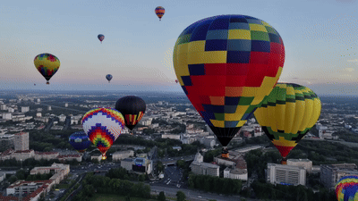
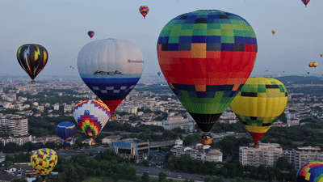
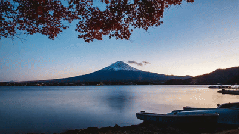
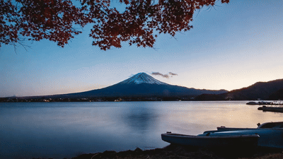

  

<h5 align="center">

  

</h5>

> The offical implementation of the paper [**Training-Free Efficient Video Generation via Dynamic Token Carving**](https://arxiv.org/abs/2505.16864) <be>
</h5>

# Visualization-of-Rectified-SpaAttn

The project intended to showcase the visualization results of Rectified SpaAttn.

## 🎥 Demo

### HunyuanVideo (128 frames, 720p)
<table>
  <tr>
    <td align="center">
       
      <em>Dense Attention (<strong>41 min</strong>)</em>
    </td>
    <td align="center">
       
      <em>Rectified SpaAttn (<strong>12 min</strong>)</em>
    </td>
    <td align="center">
       
      <em>Rectified SpaAttn (<strong>8 min</strong>)</em>
    </td>
  </tr>
</table>

  <strong>prompt:</strong>
  <em>"several hot air balloons flying over a city."</em> 

### Wan2.1-T2V (81 frames, 720p)
<table>
  <tr>
    <td align="center">
       
      <em>Dense Attention (<strong>46 min</strong>)</em>
    </td>
    <td align="center">
       
      <em>Rectified SpaAttn (<strong>25 min</strong>)</em>
    </td>
    <td align="center">
       
      <em>Rectified SpaAttn (<strong>10 min</strong>)</em>
    </td>
  </tr>
</table>

  <strong>prompt:</strong>
  <em>"A sleek white yacht gliding across a crystal-blue sea at sunset, camera circles the vessel as golden light sparkles on gentle waves, slight lens distortion."</em> 

### Wan2.1-I2V (81 frames, 720p)
<table>
  <tr>
    <td align="center">
       
      <em>Dense Attention (<strong>46 min</strong>)</em>
    </td>
    <td align="center">
       
      <em>Rectified SpaAttn (<strong>22 min</strong>)</em>
    </td>
    <td align="center">
       
      <em>Rectified SpaAttn (<strong>5 min</strong>)</em>
    </td>
  </tr>
</table>

  <strong>prompt:</strong>
  <em>"a boat sits on the shore of a lake with mt fuji in the background."</em> 

### Flux.1-dev (4096 × 4096 Resolution)
<table>
  <tr>
    <td align="center">
       
      <em>Dense Attention (<strong>15 min</strong>)</em>
    </td>
    <td align="center">
       
      <em>Rectified SpaAttn (<strong>9 min</strong>)</em>
    </td>
    <td align="center">
       
      <em>Rectified SpaAttn (<strong>4 min</strong>)</em>
    </td>
  </tr>
</table>

  <strong>prompt:</strong>
  <em>"Mountain landscape with a wooden sign reading Rectified SpaAttn."</em> 

